# Purple Team SOC Lab — Wazuh SIEM Deployment & Detection Engineering

A 4-VM VirtualBox lab built to deploy and harden a Wazuh SIEM, onboard Linux/Windows agents, and layer on detection engineering (FIM, vulnerability detection, VirusTotal integration, Auditd, Sysmon, Suricata IDS, Fail2ban) — built as part of a Purple Team–based SOC Architecture project (SIEM + MITRE ATT&CK).

## Lab Topology

| # | Role | OS | Adapter 1 | Adapter 2 | IP |
|---|------|----|-----------|-----------|----|
| 1 | SIEM (Wazuh Indexer + Manager + Dashboard) | Ubuntu | NAT | Internal (`PurpleLab`) | `192.168.100.20` |
| 2 | Attacker | Kali Linux | Internal (`PurpleLab`) | NAT | `192.168.100.10` |
| 3 | Victim 1 | Ubuntu | Internal (`PurpleLab`) | disabled | `192.168.100.30` |
| 4 | Victim 2 | Windows | Internal (`PurpleLab`) | disabled | `192.168.100.40` |

All four machines sit on the same internal network (`PurpleLab`, `192.168.100.0/24`) so the SIEM can reach every agent, while the SIEM and attacker also keep a NAT adapter for internet access (package downloads, updates).

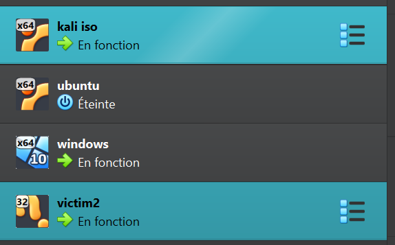

---

## Step 1 — Network Setup

### Machine 1 — Ubuntu SIEM (dashboard / log collector)

In VirtualBox (VM powered off):
- Adapter 1 → NAT
- Adapter 2 → Internal Network → name: `PurpleLab`

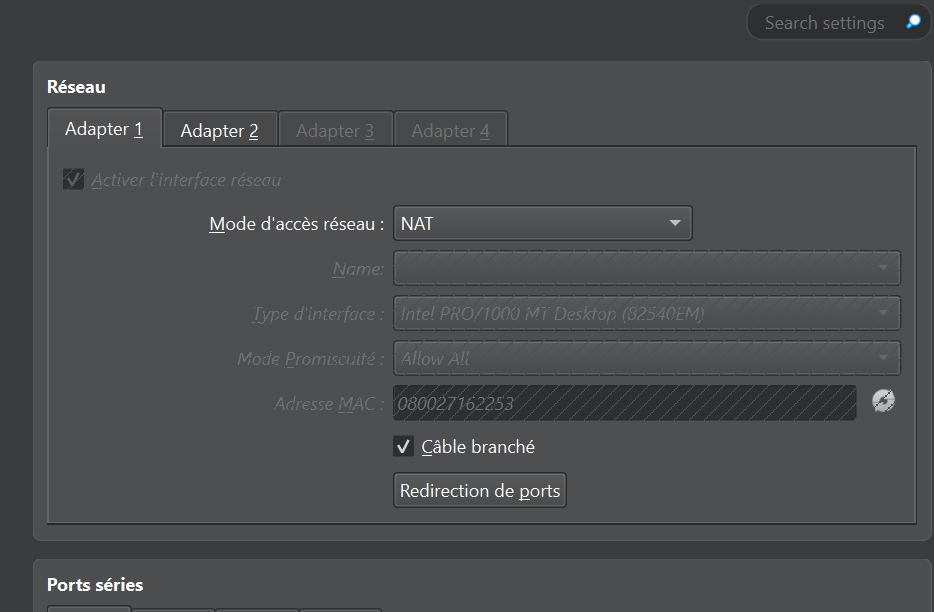
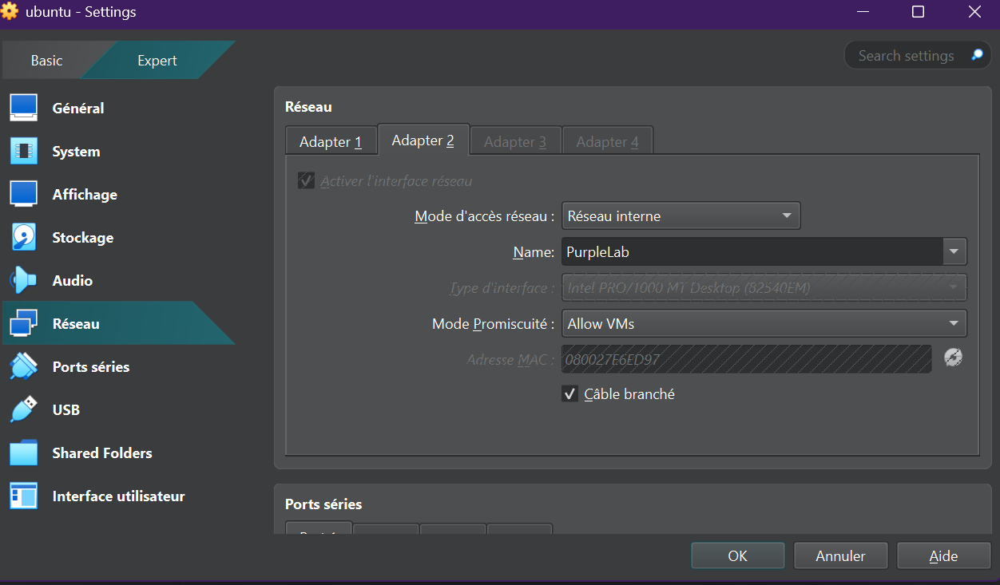

Netplan config:
```yaml
network:
  version: 2
  ethernets:
    enp0s3:
      dhcp4: true
    enp0s8:
      addresses:
        - 192.168.100.20/24
```
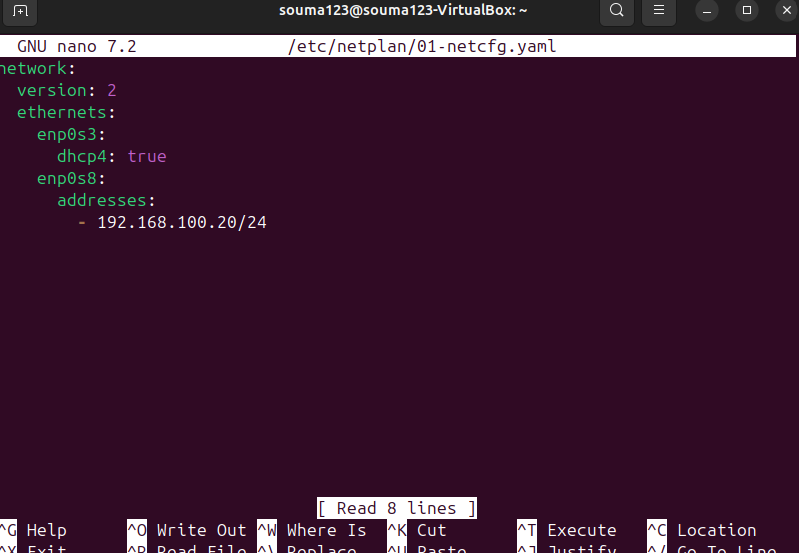

### Machine 2 — Kali Linux (attacker)

In VirtualBox (VM powered off):
- Adapter 1 → Internal Network → `PurpleLab`
- Adapter 2 → NAT

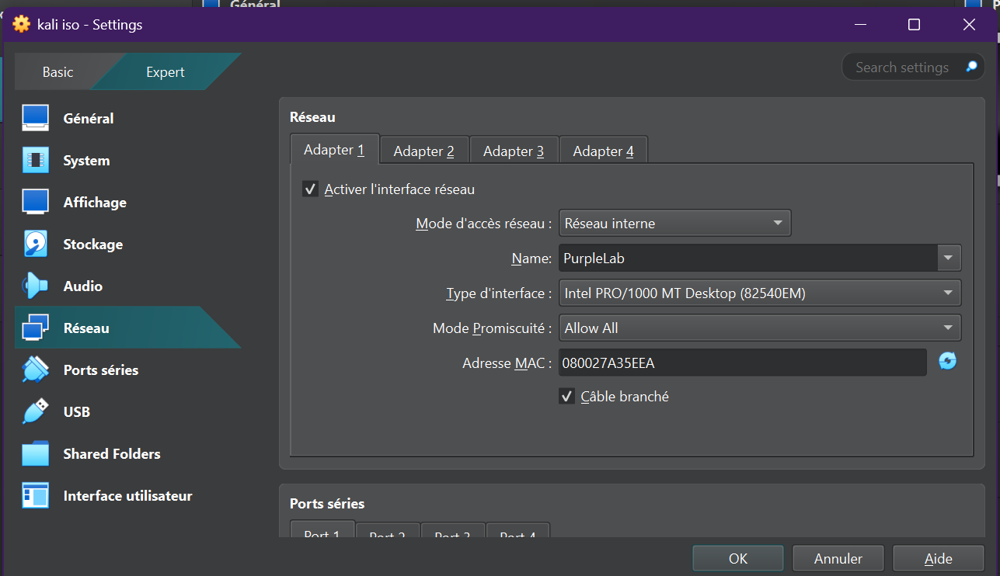
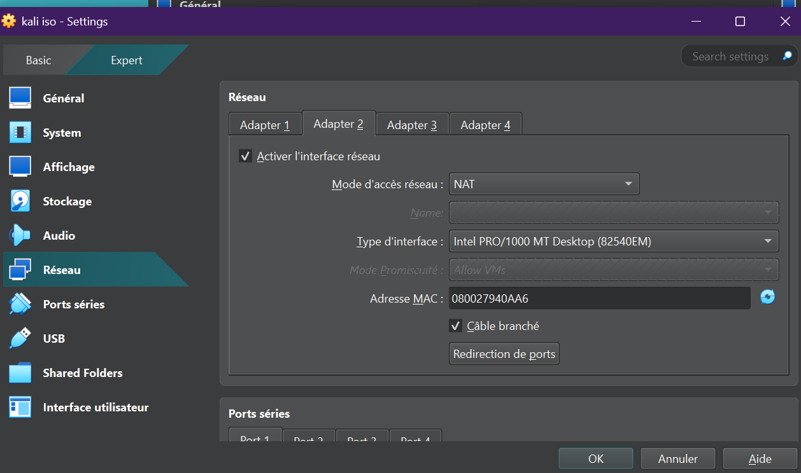

Boot Kali, then in a terminal:
```bash
ip link show
```
Note which interfaces appear (typically `eth0` and `eth1`). Then:
```bash
sudo nano /etc/network/interfaces
```
Append:
```
auto eth0
iface eth0 inet static
address 192.168.100.10
netmask 255.255.255.0

auto eth1
iface eth1 inet dhcp
```
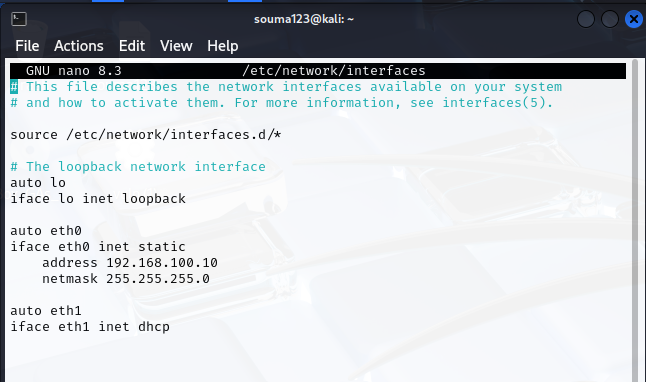

Save (`Ctrl+X`, `Y`, `Enter`), then:
```bash
sudo systemctl restart networking
ip addr show eth0
ping 192.168.100.20
```
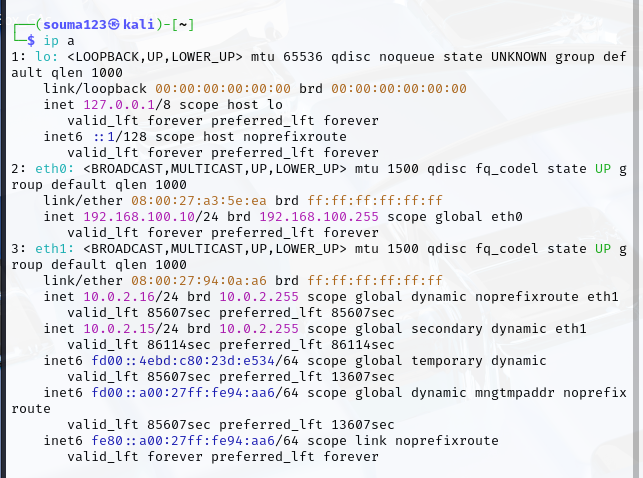
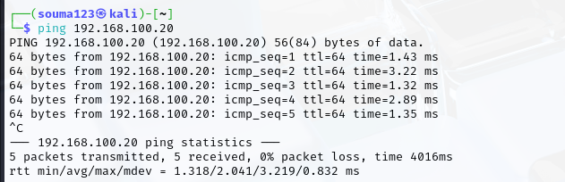

Also ping back from the Ubuntu SIEM machine to confirm bidirectional connectivity — this worked correctly.

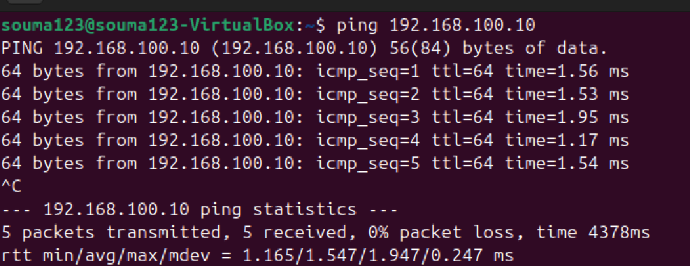

### Machine 3 — Ubuntu Victim

In VirtualBox (VM powered off):
- Adapter 1 → Internal Network → `PurpleLab`
- Adapter 2 → disabled

Boot Ubuntu Victim, then:
```bash
ip link show
```
Identify the interface (typically `enp0s3`). Then:
```bash
sudo nano /etc/netplan/01-netcfg.yaml
```
Paste exactly:
```yaml
network:
  version: 2
  ethernets:
    enp0s3:
      addresses:
        - 192.168.100.30/24
```
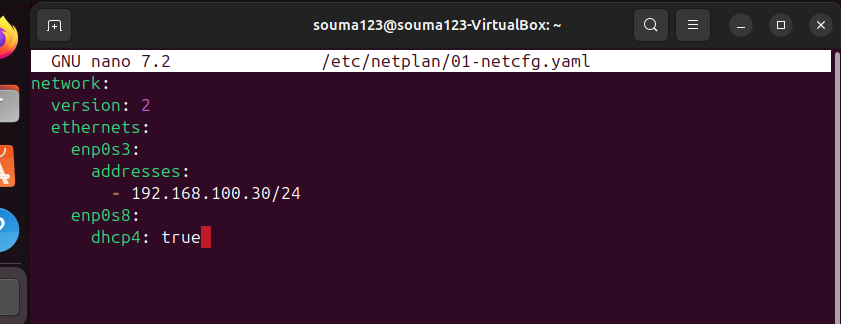
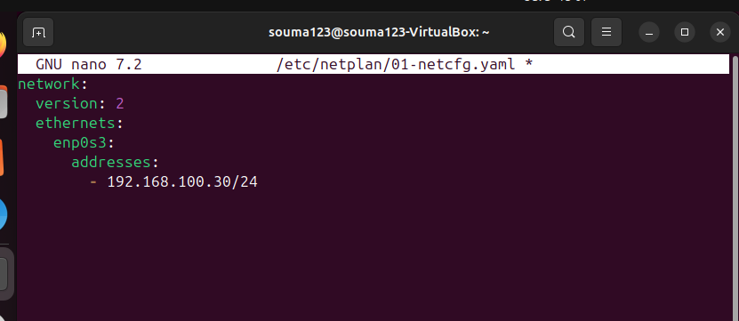

Apply the config, backing up and removing the conflicting cloud-init netplan file:
```bash
sudo cp /etc/netplan/50-cloud-init.yaml /etc/netplan/50-cloud-init.yaml.backup
sudo rm /etc/netplan/50-cloud-init.yaml
sudo chmod 600 /etc/netplan/01-netcfg.yaml
sudo netplan generate
sudo netplan get
sudo netplan apply
ip a show enp0s3
```
Verify the route and reachability of the SIEM's Wazuh ports:
```bash
ip route
ping -c 4 192.168.100.20
nc -zv 192.168.100.20 1514
nc -zv 192.168.100.20 1515
```
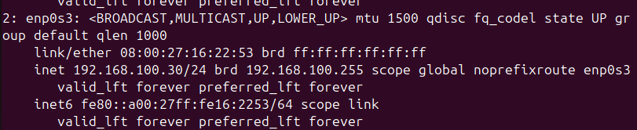

All three checks succeeded — full ping connectivity confirmed in both directions between the victim, the Kali attacker, and the Ubuntu SIEM dashboard.

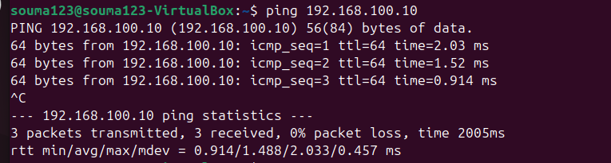
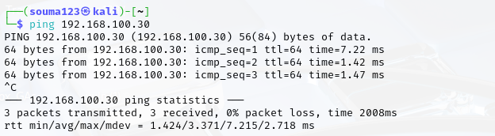
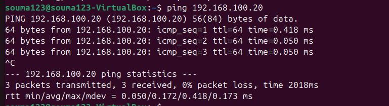
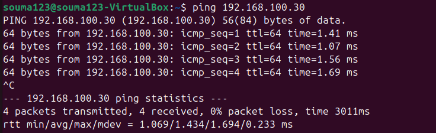

### Machine 4 — Windows Victim

In VirtualBox (VM powered off):
- Adapter 1 → Internal Network → `PurpleLab`
- Adapter 2 → disabled

Boot Windows, then:
1. Right-click the network icon (bottom right) → **Open Network & Internet settings**
2. **Network and Sharing Center**
3. **Change adapter settings**
4. Right-click the Ethernet adapter → **Properties**
5. Double-click **Internet Protocol Version 4 (TCP/IPv4)**
6. Select **Use the following IP address** and fill in:
   - IP address: `192.168.100.40`
   - Subnet mask: `255.255.255.0`
   - Default gateway: leave blank
7. Click **OK**

Verify from `cmd`:
```
ping 192.168.100.20
```
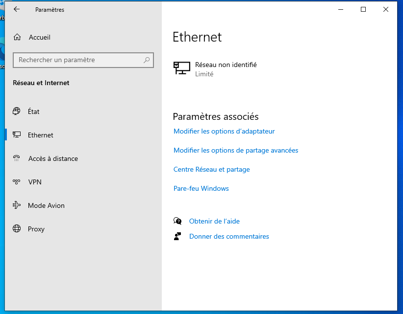
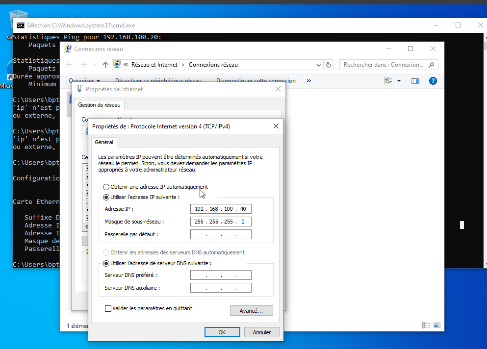

Pinging the Ubuntu SIEM from Windows worked.

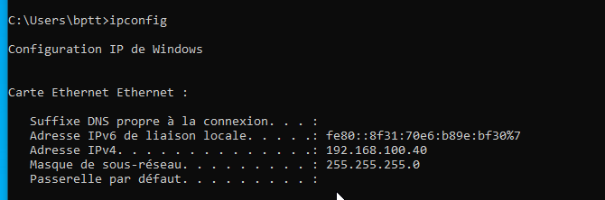
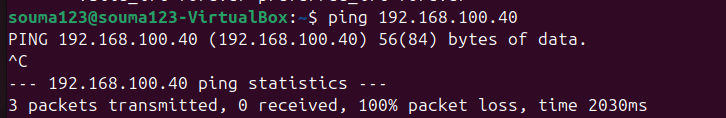

Pinging **from** Ubuntu **to** the Windows victim initially failed — this was resolved by disabling the Windows Firewall, after which the ping succeeded in both directions.

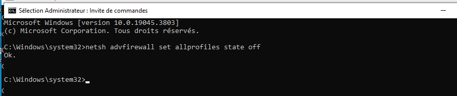
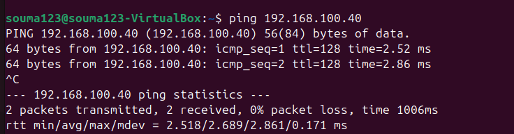

Ping between the Ubuntu victim and the Windows victim was also confirmed working.

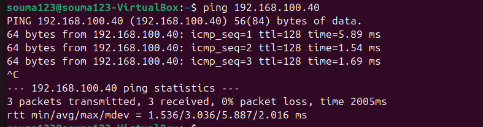

### Final connectivity test from Kali

Once all four machines are configured, from Kali:
```bash
ping 192.168.100.20 -c 3   # SIEM
ping 192.168.100.30 -c 3   # Ubuntu victim
ping 192.168.100.40 -c 3   # Windows victim
```
All three must respond before moving on to the Wazuh installation.

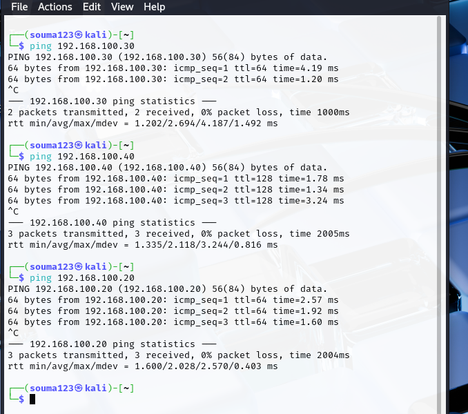

---

## Step 2 — Install Wazuh (Indexer + Manager + Dashboard, all-in-one)

Update Ubuntu first:
```bash
sudo apt update && sudo apt upgrade -y
```
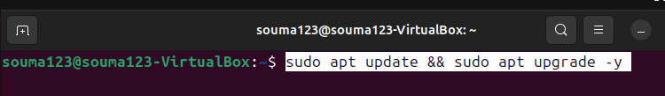

Wazuh ships an official all-in-one install script:


```bash
curl -sO https://packages.wazuh.com/4.9/wazuh-install.sh
curl -sO https://packages.wazuh.com/4.9/config.yml
```
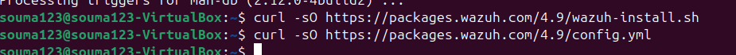

Edit `config.yml` — clear its contents and paste:
```yaml
nodes:
  indexer:
    - name: node-1
      ip: 192.168.100.20
  server:
    - name: wazuh-1
      ip: 192.168.100.20
  dashboard:
    - name: dashboard
      ip: 192.168.100.20
```
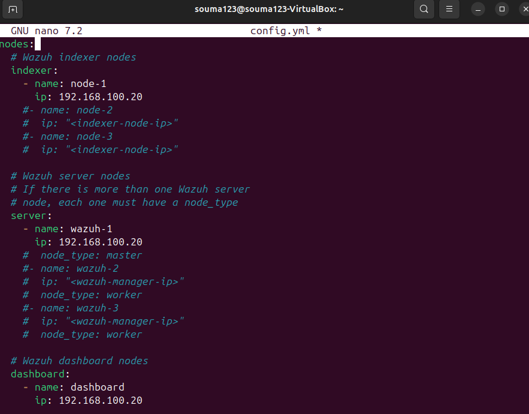

Run the installer:
```bash
sudo bash wazuh-install.sh --generate-config -i
```
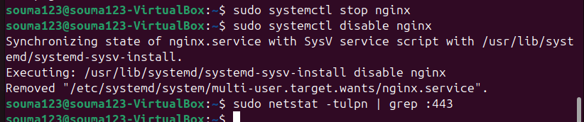
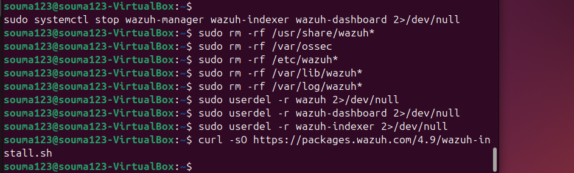

**Issue hit — disk space.** The install initially failed because the VM disk was too small. Fix:
1. Resize the VirtualBox virtual disk to 51200 MB (50 GB) from the host.
2. Boot Ubuntu back up and grow the partition inside the guest:
```bash
sudo growpart /dev/sda 2
sudo resize2fs /dev/sda2
df -h
```
Confirm `/dev/sda2` now shows ~50G total with plenty available, then re-download and re-run the installer:
```bash
curl -sO https://packages.wazuh.com/4.9/wazuh-install.sh
curl -sO https://packages.wazuh.com/4.9/config.yml
nano config.yml   # re-check/paste the config above
sudo bash wazuh-install.sh -a -i
```
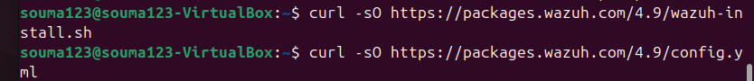
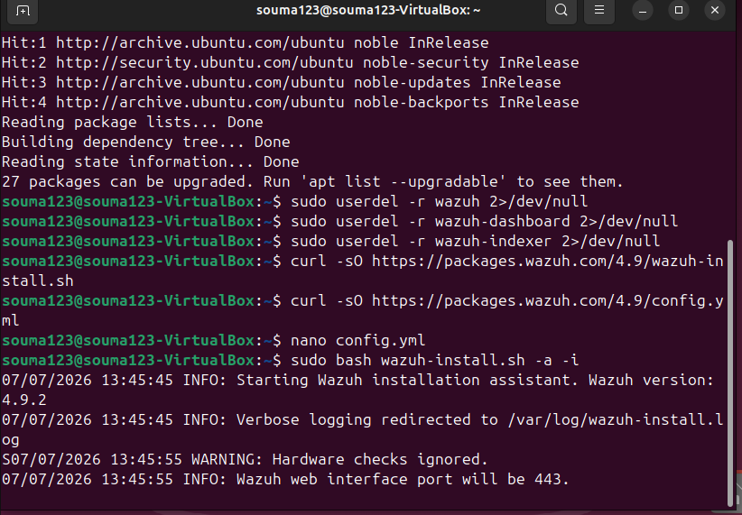
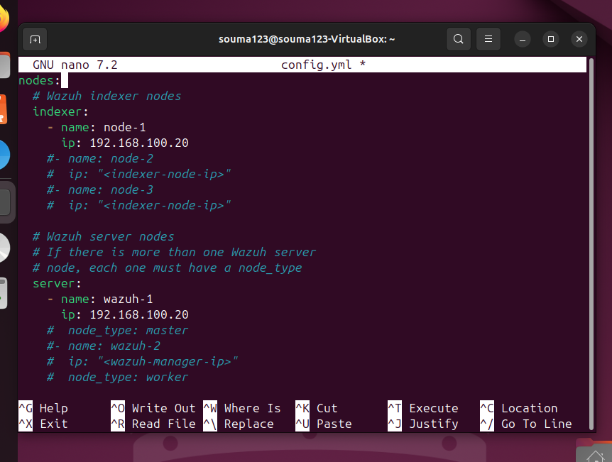
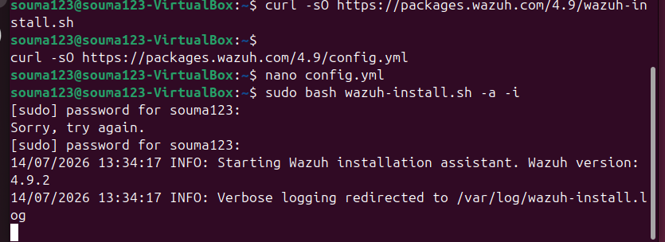
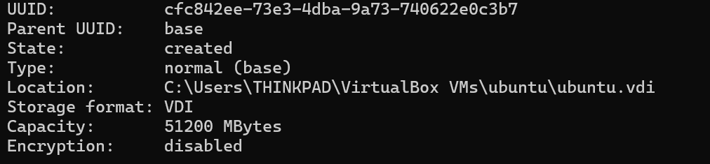

If port 443 is already bound from a previous failed attempt, clean up first, then re-run with the overwrite flag:
```bash
sudo bash wazuh-install.sh -a -i --o
```
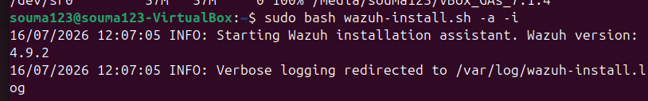
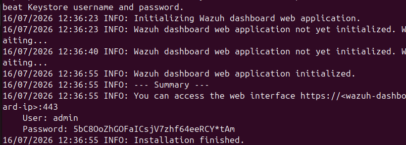

Installation succeeded after the resize.

### Access the dashboard

From your host machine's browser:
```
https://192.168.100.20:443
```
(using the `enp0s8` IP on the `192.168.100.0/24` lab subnet). You'll hit a self-signed certificate warning — expected for a lab setup, accept it to proceed.

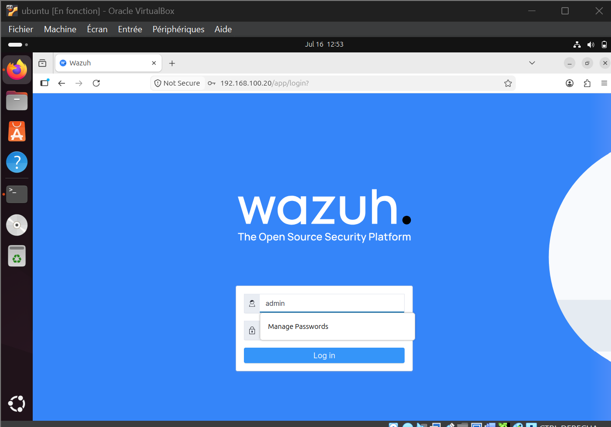

### Sanity checks

```bash
sudo systemctl status wazuh-indexer wazuh-manager wazuh-dashboard filebeat --no-pager
df -h
```
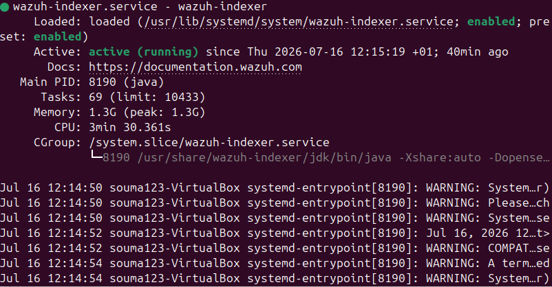
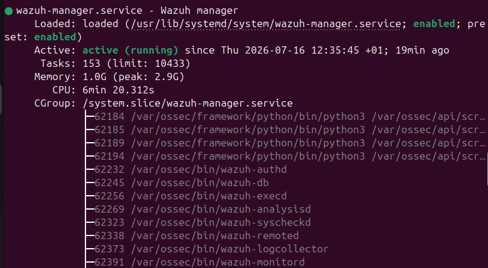
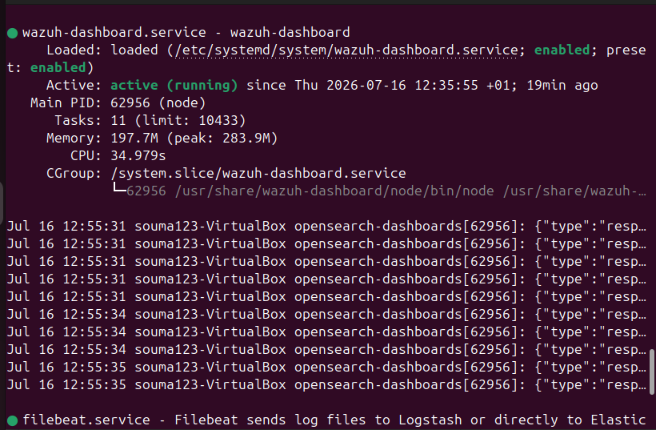
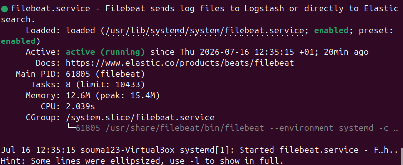
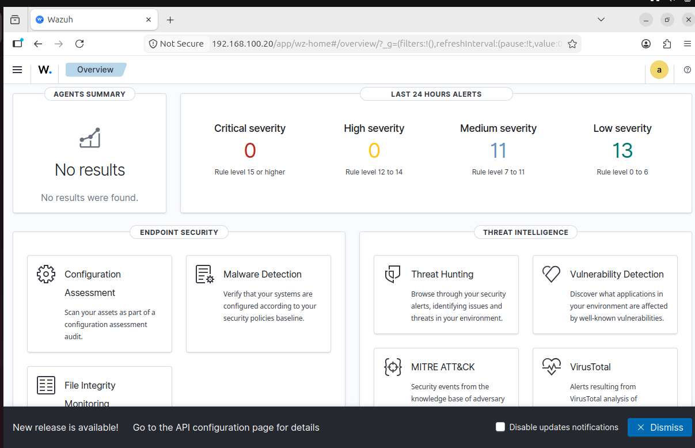

All four services should show `active (running)`. Also confirm the manager is listening on the agent enrollment/API ports:
```bash
sudo netstat -tulnp | grep -E '1514|1515|55000'
```
- `1514` = agent event port
- `1515` = agent enrollment port
- `55000` = Wazuh API

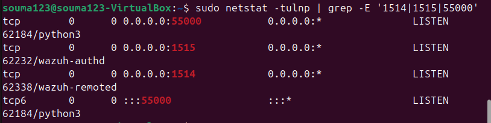

---

## Step 3 — Deploy Agents

### Kali (attacker)

```bash
curl -o wazuh-agent.deb https://packages.wazuh.com/4.x/apt/pool/main/w/wazuh-agent/wazuh-agent_4.9.2-1_amd64.deb
sudo WAZUH_MANAGER='192.168.100.20' dpkg -i ./wazuh-agent.deb
sudo systemctl daemon-reload
sudo systemctl enable wazuh-agent
sudo systemctl start wazuh-agent
```
- `sudo` — run with root privileges (required to install packages)
- `WAZUH_MANAGER='192.168.100.20'` — environment variable that tells the agent which Wazuh manager to report to
- `dpkg -i ./wazuh-agent.deb` — installs the downloaded Debian package

This installs the agent, points it at the manager, generates its config files, and registers it as a systemd service.

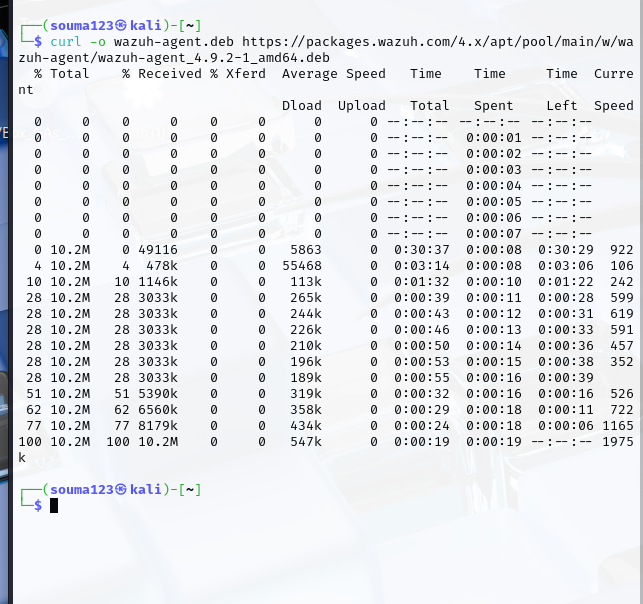
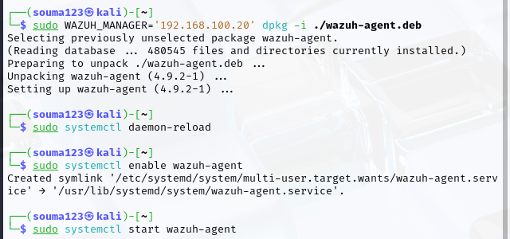
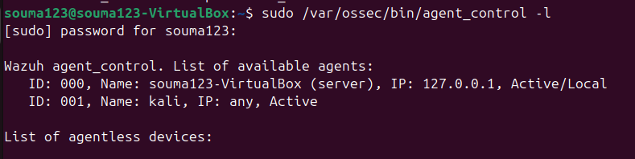

> Note: for larger fleets (banking/enterprise SOC environments), this same package + config would typically be pushed at scale via a configuration management tool such as **Ansible**, rather than installed by hand on every host.

### Ubuntu Victim

1. On the Ubuntu SIEM, download the agent package:
```bash
curl -o wazuh-agent.deb https://packages.wazuh.com/4.x/apt/pool/main/w/wazuh-agent/wazuh-agent_4.9.2-1_amd64.deb
```
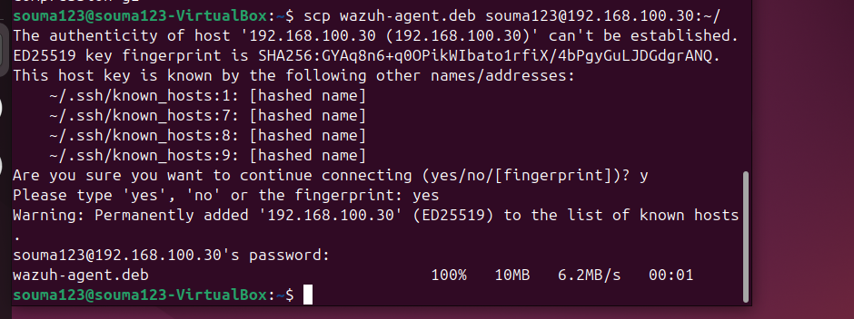

2. Transfer it to the Ubuntu Victim and confirm it arrived:
```bash
ls -la wazuh-agent.deb
```


3. Install the agent:
```bash
sudo WAZUH_MANAGER='192.168.100.20' dpkg -i ./wazuh-agent.deb
sudo systemctl daemon-reload
sudo systemctl enable wazuh-agent
sudo systemctl start wazuh-agent
```
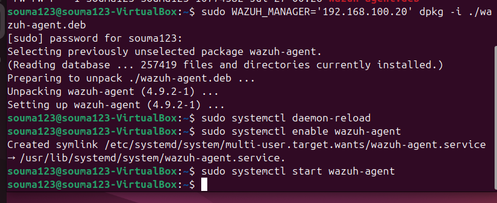

4. Verify it's running:
```bash
sudo systemctl status wazuh-agent --no-pager
```
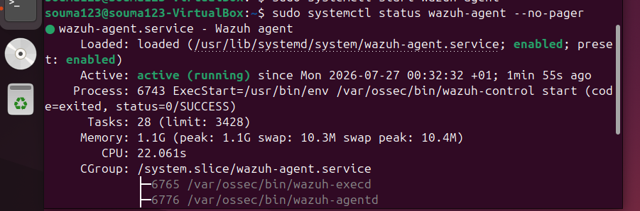

5. Confirm enrollment/connection:
```bash
sudo grep "wazuh-agentd" /var/ossec/logs/ossec.log | tail -20
```


6. Back on the Ubuntu SIEM, confirm the agent shows up:
```bash
sudo /var/ossec/bin/agent_control -l
```


### Windows Victim

1. On the Ubuntu SIEM, download the Windows MSI:
```bash
curl -o wazuh-agent.msi https://packages.wazuh.com/4.x/windows/wazuh-agent-4.9.2-1.msi
ls -la wazuh-agent.msi
```


2. Still on the Ubuntu SIEM, serve it over the internal lab network with a temporary web server:
```bash
python3 -m http.server 8000
```


3. On the Windows Victim, open a browser and go to:
```
http://192.168.100.20:8000/wazuh-agent.msi
```
This downloads over the `192.168.100.0/24` lab subnet (confirmed reachable, since the Windows adapter is on `192.168.100.40`). Save it to `Downloads`.


4. Back on the Ubuntu SIEM, stop the web server (`Ctrl+C`).

5. On the Windows Victim, open PowerShell **as Administrator** and navigate to Downloads:
```powershell
cd $env:USERPROFILE\Downloads
dir
```


6. Run the install with logging:
```powershell
msiexec /i wazuh-agent.msi /l*v install_log.txt /qn WAZUH_MANAGER=192.168.100.20 WAZUH_AGENT_NAME=win-victim
```
(`/qn` — fully silent/no UI; more reliable in practice than `/q`.)


7. Wait ~15–20 seconds, then check the log was created and inspect the tail:
```powershell
dir install_log.txt
Get-Content install_log.txt -Tail 40
```
8. Check the service exists and start it:
```powershell
Get-Service -Name WazuhSvc
NET START WazuhSvc
```


```powershell
Get-Service -Name WazuhSvc
```


Status should change to `Running`.

9. Check the agent's connection log:
```powershell
Get-Content "C:\Program Files (x86)\ossec-agent\ossec.log" -Tail 20
```


Look for `Connected to the server ([192.168.100.20]:1514/tcp)` — the same success pattern seen on Kali and the Ubuntu victim.

10. Back on the Ubuntu SIEM, confirm all agents are listed:
```bash
sudo /var/ossec/bin/agent_control -l
```


11. Housekeeping — clean up leftover install files and enable auto-start:
```powershell
cd $env:USERPROFILE\Downloads
Remove-Item install_log.txt
Set-Service -Name WazuhSvc -StartupType Automatic
Get-Service WazuhSvc | Select-Object Name, StartType, Status
```

12. Verify File Integrity Monitoring (`syscheck`) is active:
```powershell
Get-Content "C:\Program Files (x86)\ossec-agent\ossec.conf" | Select-String "syscheck" -Context 0,3
```

13. Confirm Windows Event Log monitoring is enabled — Windows victims should feed `Security`/`System`/`Application` logs into Wazuh, which matters for MITRE ATT&CK mapping later (many Windows techniques rely on Security event log detection, e.g. Event ID 4625 failed logon → T1110):
```powershell
Get-Content "C:\Program Files (x86)\ossec-agent\ossec.conf" | Select-String "localfile" -Context 0,2
```
You want to see entries for Security, Application, and System event logs — Wazuh's default Windows config usually already includes these.

14. Back on the Ubuntu SIEM, verify the `win-victim` agent is actively reporting data (not just connected):
```bash
sudo tail -20 /var/ossec/logs/alerts/alerts.log
```
Or check via the dashboard: **Agents → win-victim** should show recent activity (syscheck scan, log collection stats).


### Agent status summary

- **Kali:** 🟢 connected
- **Ubuntu victim:** 🔴 not connected *(known issue at time of writing)*
- **Windows victim:** 🟢 connected


All three agent types were successfully deployed; FIM was verified enabled on the Windows victim.


---

## Detection Engineering

### File Integrity Monitoring (FIM)

FIM was enabled and tested on both the Ubuntu and Windows endpoints.


On Ubuntu:


On Windows, testing was done by creating and then modifying a file on the Desktop via Notepad / `Out-File`.

```
notepad "C:\Program Files (x86)\ossec-agent\ossec.conf"
```


Example alert sequence observed:
- **Line 1 — added** (rule id `554`, level 5): *"File added to the system."* — matches the file created on the Desktop. Level 5 = low severity, normal for a simple file addition.
- **Line 2 — modified** (rule id `550`, level 7): *"Integrity checksum changed."* — the file's content or metadata changed after creation, so the checksum computed by Wazuh no longer matches the one recorded at creation time. Level 7 is higher, since a checksum change can indicate file tampering (expected here, since it was a deliberate edit).

This is exactly the expected behavior of a properly configured FIM: a **create** event is detected first (`added`), followed by a **content change** event (`modified`) once the checksum diverges.

### Vulnerability Detection

Wazuh's vulnerability detection module was enabled to scan installed packages against known CVEs.


### VirusTotal Integration

Inside `<ossec_config>`, a VirusTotal integration block was added (group = `syscheck`) so that files flagged by FIM on the `win-victim` agent are automatically submitted for reputation checks — tested with the EICAR test file.


```xml
<!-- inside <ossec_config> -->
```


Save the file and restart the manager:
```bash
sudo systemctl restart wazuh-manager
```


### Auditd — Monitoring Malicious Command Execution (Linux)


Install and configure `auditd` on the Ubuntu agent:


Create a CDB list of suspicious programs:
```bash
sudo nano /var/ossec/etc/lists/suspicious-programs
```


Then locate the `<ruleset>` section in `/var/ossec/etc/ossec.conf` and wire it in:


Restart the manager:
```bash
sudo systemctl restart wazuh-manager
```


### Process Monitoring — Unauthorized Process Detection (Linux)

Enabled Wazuh's process-list monitoring:


Then restarted the agent and manager:
```bash
sudo systemctl restart wazuh-agent
```


```bash
sudo systemctl restart wazuh-manager
```


#### Auditd vs. Process Monitoring

Although both mechanisms monitor activity on a machine, **Auditd** and **Process Monitoring** serve different purposes and work differently.

**Auditd** logs commands and actions executed on the system, even ones that only run for a second. It can identify:
- **Who** ran the command
- **When** it was run
- **On which host** it was run
- **What** command was run

However, Auditd cannot tell you whether a process is **still running** after it was launched.

**Process Monitoring** watches which processes are currently active. In this lab, the process list is checked every **30 seconds**, which makes it possible to detect whether a program is still running.

This is especially useful for detecting **persistent malicious activity** — an attacker might launch a backdoor or reverse shell that stays active for hours. Even if the original command execution is no longer visible in the logs, the process itself remains present on the system and can be caught by Process Monitoring. Tools like `ncat`, `socat`, or `python3 -m http.server` can be started and stay active for a long time — Process Monitoring detects their presence for as long as they keep running.

**The two are complementary:** Auditd tells you *that an action was executed*; Process Monitoring tells you *that a process is still active*. Together they improve SOC visibility, covering both one-off actions and persistent processes.

### DNS Troubleshooting

A DNS resolution issue encountered along the way was diagnosed and resolved.


### Sysmon — Monitoring Windows Events

On the Windows agent, download **Sysmon** from Microsoft Sysinternals:
```
https://learn.microsoft.com/en-us/sysinternals/downloads/sysmon
```
Also download a community Sysmon config tuned for Wazuh:
```
https://github.com/paolokappa/Sysmon_Config_for_Wazuh
```


Add a `<localfile>` block to the agent config so it forwards Sysmon's event channel to the manager:
```xml
<localfile>
  <location>Microsoft-Windows-Sysmon/Operational</location>
  <log_format>eventchannel</log_format>
</localfile>
```
This line lets the Wazuh agent monitor Sysmon logs and send them to the Wazuh manager.


Restart the manager:
```bash
sudo systemctl restart wazuh-manager
```


Test with a registry persistence technique:
```powershell
reg add "HKCU\Software\Microsoft\Windows\CurrentVersion\Run" /v TestPersistence /t REG_SZ /d "notepad.exe" /f
```

#### Sample alert triage — "What happened?"

For every Sysmon alert in Wazuh, walk through these questions in order:

| Question | Answer (example alert) |
|---|---|
| Rule name | Registry entry to be executed on next logon was modified using command line application `reg.exe` |
| Severity / Time | Level 6 (Medium) — 2026-07-13 16:34:11 UTC |
| Host / IP | `DESKTOP-AQSFJPH` (Wind10), `192.168.1.7` |
| Sysmon Event ID | 13 (registry value edit) |
| Process / image / user | `notepad.exe`, `C:\Windows\system32\reg.exe`, `DESKTOP-AQSFJPH\mohamed` |
| Tactic / Technique | *(map to MITRE ATT&CK, e.g. Persistence / Registry Run Keys — T1547.001)* |

This triage checklist feeds into the initial triage and investigation phase of the exercise.

### Suricata IDS Integration

Install and update Suricata:
```bash
sudo apt install suricata -y
sudo suricata-update
```
Edit `/etc/suricata/suricata.yaml` to point at the lab's `HOME_NET`:


Then add custom rules:

**1. Detect ICMP ping**
```
alert icmp any any -> $HOME_NET any (msg:"LAB - ICMP Ping Detected"; sid:1000001; rev:1;)
```
Alerts whenever someone pings a machine in the lab network.

**2. Detect SSH connection attempts**
```
alert tcp any any -> $HOME_NET 22 (msg:"LAB - SSH Connection Attempt"; flags:S; sid:1000002; rev:1;)
```
Detects TCP SYN packets aimed at SSH port 22.

**3. Detect HTTP traffic**
```
alert tcp any any -> $HOME_NET 80 (msg:"LAB - HTTP Connection Detected"; flags:S; sid:1000003; rev:1;)
```
Useful when the victim runs a web server.

**4. Detect a TCP SYN scan**
```
alert tcp any any -> $HOME_NET any (msg:"LAB - TCP SYN Scan Activity"; flags:S; threshold:type both, track by_src, count 10, seconds 5; sid:1000004; rev:1;)
```
Alerts when the same source sends 10 SYN packets within 5 seconds toward the protected network — a much better signal for a Purple Team demo than alerting on every single SYN packet.


Reload and restart:
```bash
sudo systemctl daemon-reload
sudo systemctl restart suricata
```


### Fail2ban — Simulated Brute-Force on the Linux Agent

*(Section in progress — brute-force simulation against the Linux agent using Fail2ban / Hydra, mapped to MITRE ATT&CK T1110.)*

---

## Status

- ✅ 4-VM network fully routed and pingable in all directions
- ✅ Wazuh 4.9.2 (Indexer + Manager + Dashboard) installed and healthy
- ✅ Agents deployed on Kali, Ubuntu Victim, and Windows Victim
- ✅ FIM verified on Windows and Ubuntu endpoints
- ✅ VirusTotal integration configured and tested with EICAR
- ✅ Auditd + Process Monitoring configured on the Linux agent
- ✅ Sysmon wired into Wazuh on the Windows agent, with a sample alert-triage workflow
- ✅ Suricata IDS deployed with custom lab detection rules
- 🚧 Fail2ban brute-force simulation — in progress
